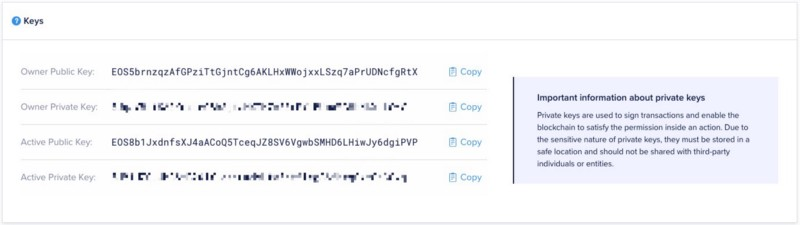

# BlockPanda


---

# Test in local

## clone repo

```sheel=
git clone https://github.com/a8252525/BlockPanda.git
```

# Test in [EOSIO Testnet](https://testnet.eos.io/)

## clone repo

```sheel=
git clone https://github.com/a8252525/BlockPanda.git
```

## Init env

```sheel=
sh -c "echo \"alias cleos='/usr/bin/cleos -u https://api.testnet.eos.io'\" >> ~/.bashrc"
source ~/.bashrc
```
## Init wallet

```sheel=
cleos -u http://$eos_endpoint wallet create --file wallet_pass.txt
cleos -u http://$eos_endpoint wallet import --private-key {private_key}
```
For `private_key`, go to [EOSIO Testnet](https://testnet.eos.io/) to get your own key-pair.



## Compile and push contract

```shell=
bash BlockPanda/blockpanda/panda.sh
```